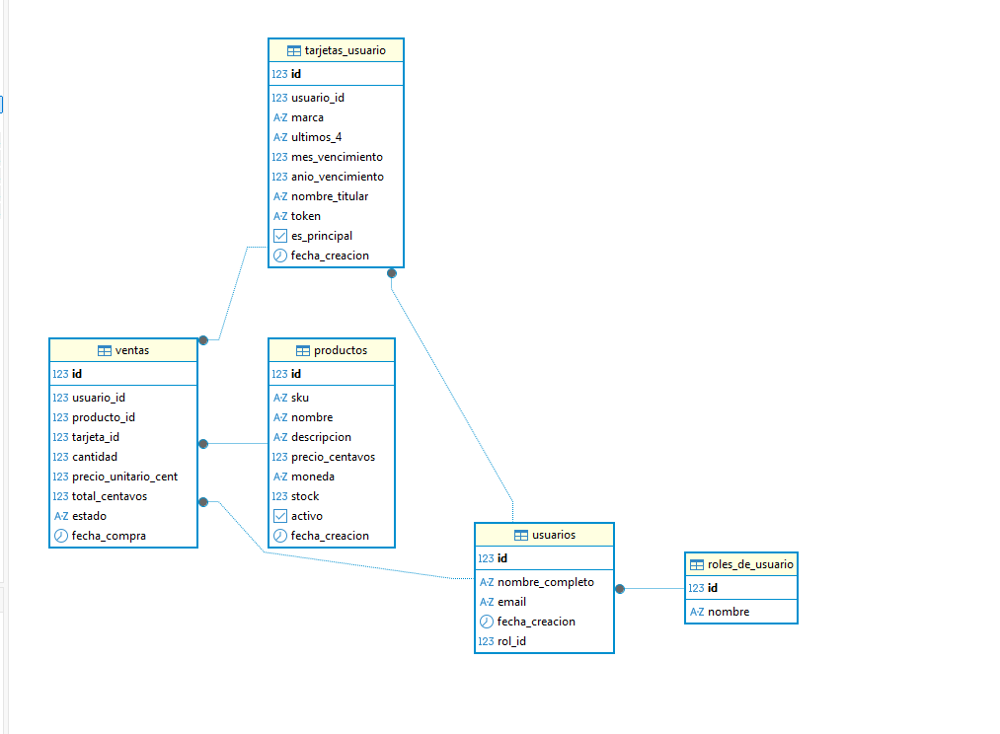
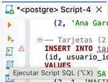
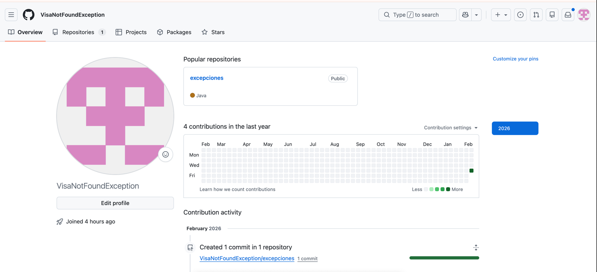

# Getting Started

### Reference Documentation
For further reference, please consider the following sections:

* [Official Apache Maven documentation](https://maven.apache.org/guides/index.html)
* [Spring Boot Maven Plugin Reference Guide](https://docs.spring.io/spring-boot/3.5.10/maven-plugin)
* [Create an OCI image](https://docs.spring.io/spring-boot/3.5.10/maven-plugin/build-image.html)
* [Spring Data JPA](https://docs.spring.io/spring-boot/3.5.10/reference/data/sql.html#data.sql.jpa-and-spring-data)
* [Spring Web](https://docs.spring.io/spring-boot/3.5.10/reference/web/servlet.html)

### Guides
The following guides illustrate how to use some features concretely:

* [Accessing Data with JPA](https://spring.io/guides/gs/accessing-data-jpa/)
* [Building a RESTful Web Service](https://spring.io/guides/gs/rest-service/)
* [Serving Web Content with Spring MVC](https://spring.io/guides/gs/serving-web-content/)
* [Building REST services with Spring](https://spring.io/guides/tutorials/rest/)

### Maven Parent overrides

Due to Maven's design, elements are inherited from the parent POM to the project POM.
While most of the inheritance is fine, it also inherits unwanted elements like `<license>` and `<developers>` from the parent.
To prevent this, the project POM contains empty overrides for these elements.
If you manually switch to a different parent and actually want the inheritance, you need to remove those overrides.

# Como levantar la app..

tirar este comandito de docker desde git bash "windows"

docker run -d \
--name postgres-db \
-e POSTGRES_USER=postgres \
-e POSTGRES_PASSWORD=postgres \
-e POSTGRES_DB=postgres \
-e TZ=America/Argentina/Buenos_Aires \
-e PGTZ=America/Argentina/Buenos_Aires \
-p 3333:5432 \
-v postgres_data:/var/lib/postgresql/data \
postgres:16-bookworm

# Conectar bbdd con DBeaver..

entrar al dbeaver, seleccionar postgres como bbdd, poner la contraseña postgres
puerto 3333 y clickear en probar conexion, si es exitoso, tocar en finalizar

# Levantar app

levantar app haciendo click derecho en application "RUN"

# Correr script de BBDD

dentro de dbeaver con la conexion hecha ejecutar el siguiente script en la pestaña SQL

BEGIN;

DROP TABLE IF EXISTS ventas;
DROP TABLE IF EXISTS tarjetas_usuario;
DROP TABLE IF EXISTS productos;
DROP TABLE IF EXISTS usuarios;
DROP TABLE IF EXISTS roles_de_usuario;

-- ============================
-- 0) TABLA: ROLES DE USUARIO
-- ============================
CREATE TABLE roles_de_usuario (
id     BIGSERIAL PRIMARY KEY,
nombre TEXT NOT NULL UNIQUE
);

-- Roles base (alineados con el enum Roles)
INSERT INTO roles_de_usuario (nombre) VALUES
('USUARIO'),
('ADMIN'),
('VIP'),
('OPERADOR'),
('BANEADO');
ON CONFLICT (nombre) DO NOTHING;

-- ============================
-- 1) TABLA: USUARIOS
-- ============================
CREATE TABLE usuarios (
id                BIGSERIAL PRIMARY KEY,
nombre_completo   TEXT NOT NULL,
email             TEXT NOT NULL UNIQUE,
fecha_creacion    TIMESTAMPTZ NOT NULL DEFAULT now(),
rol_id            BIGINT NOT NULL REFERENCES roles_de_usuario(id)
);

-- ============================
-- 2) TABLA: TARJETAS DE USUARIO
-- ============================
CREATE TABLE tarjetas_usuario (
id                BIGSERIAL PRIMARY KEY,
usuario_id        BIGINT NOT NULL REFERENCES usuarios(id) ON DELETE CASCADE,
marca             TEXT NOT NULL, -- VISA / MASTERCARD / AMEX
ultimos_4         CHAR(4) NOT NULL CHECK (ultimos_4 ~ '^[0-9]{4}$'),
mes_vencimiento   SMALLINT NOT NULL CHECK (mes_vencimiento BETWEEN 1 AND 12),
anio_vencimiento  SMALLINT NOT NULL CHECK (anio_vencimiento BETWEEN 2024 AND 2099),
nombre_titular    TEXT NOT NULL,
token             TEXT NOT NULL UNIQUE,
es_principal      BOOLEAN NOT NULL DEFAULT false,
fecha_creacion    TIMESTAMPTZ NOT NULL DEFAULT now()
);

-- ============================
-- 3) TABLA: PRODUCTOS
-- ============================
CREATE TABLE productos (
id                BIGSERIAL PRIMARY KEY,
sku               TEXT NOT NULL UNIQUE,
nombre            TEXT NOT NULL,
descripcion       TEXT,
precio_centavos   INTEGER NOT NULL CHECK (precio_centavos >= 0),
moneda            CHAR(3) NOT NULL DEFAULT 'ARS',
stock             INTEGER NOT NULL DEFAULT 0 CHECK (stock >= 0),
activo            BOOLEAN NOT NULL DEFAULT true,
fecha_creacion    TIMESTAMPTZ NOT NULL DEFAULT now()
);

-- ============================
-- 4) TABLA: VENTAS
-- ============================
CREATE TABLE ventas (
id                   BIGSERIAL PRIMARY KEY,
usuario_id           BIGINT NOT NULL REFERENCES usuarios(id),
producto_id          BIGINT NOT NULL REFERENCES productos(id),
tarjeta_id           BIGINT NOT NULL REFERENCES tarjetas_usuario(id),
cantidad             INTEGER NOT NULL CHECK (cantidad > 0),
precio_unitario_cent INTEGER NOT NULL CHECK (precio_unitario_cent >= 0),
total_centavos       INTEGER NOT NULL CHECK (total_centavos >= 0),
estado               TEXT NOT NULL DEFAULT 'PAGADA', -- PAGADA / PENDIENTE / CANCELADA
fecha_compra         TIMESTAMPTZ NOT NULL DEFAULT now()
);

-- ============================
-- INSERTS DE DATOS FALSOS
-- ============================

-- Usuarios (USUARIO por defecto)
INSERT INTO usuarios (id, nombre_completo, email, fecha_creacion, rol_id) VALUES
(1, 'Juan Pérez', 'juan.perez@correo.com', '2026-02-01 10:15:00-03',
(SELECT id FROM roles_de_usuario WHERE nombre='USUARIO')),
(2, 'Ana García', 'ana.garcia@correo.com', '2026-02-02 12:40:00-03',
(SELECT id FROM roles_de_usuario WHERE nombre='USUARIO'));

-- Tarjetas (2 por usuario)
INSERT INTO tarjetas_usuario
(id, usuario_id, marca, ultimos_4, mes_vencimiento, anio_vencimiento, nombre_titular, token, es_principal, fecha_creacion)
VALUES
(1, 1, 'VISA',       '4242', 12, 2028, 'JUAN PEREZ', 'tok_juan_visa_4242', true,  '2026-02-03 09:00:00-03'),
(2, 1, 'MASTERCARD', '4444',  6, 2027, 'JUAN PEREZ', 'tok_juan_mc_4444',   false, '2026-02-03 09:05:00-03'),
(3, 2, 'VISA',       '1111', 11, 2029, 'ANA GARCIA', 'tok_ana_visa_1111',  true,  '2026-02-03 09:10:00-03'),
(4, 2, 'AMEX',       '0005',  3, 2027, 'ANA GARCIA', 'tok_ana_amex_0005',  false, '2026-02-03 09:15:00-03');

-- Productos
INSERT INTO productos
(id, sku, nombre, descripcion, precio_centavos, moneda, stock, activo, fecha_creacion)
VALUES
(1, 'SKU-001', 'Mouse inalámbrico', 'Mouse 2.4Ghz con receptor USB', 15999, 'ARS', 50, true, '2026-02-01 08:00:00-03'),
(2, 'SKU-002', 'Teclado mecánico',  'Switches blue, layout español', 49999, 'ARS', 25, true, '2026-02-01 08:05:00-03'),
(3, 'SKU-003', 'Auriculares',       'Over-ear con cancelación pasiva', 29999, 'ARS', 40, true, '2026-02-01 08:10:00-03'),
(4, 'SKU-004', 'Monitor 24"',       'Full HD 1080p 75Hz', 189999, 'ARS', 10, true, '2026-02-01 08:15:00-03'),
(5, 'SKU-005', 'Webcam HD',         '720p con micrófono incorporado', 27999, 'ARS', 30, true, '2026-02-01 08:20:00-03');

-- Ventas (3 ventas)
INSERT INTO ventas
(id, usuario_id, producto_id, tarjeta_id, cantidad, precio_unitario_cent, total_centavos, estado, fecha_compra)
VALUES
(1, 1, 2, 1, 1, 49999, 49999, 'PAGADA', '2026-02-05 14:22:00-03'),
(2, 2, 1, 3, 2, 15999, 31998, 'PAGADA', '2026-02-06 10:05:00-03'),
(3, 1, 3, 2, 1, 29999, 29999, 'PAGADA', '2026-02-07 19:40:00-03');

COMMIT;

para correr script tocar en la hoja con el triangulito dentro (3er icono)

# Opción B: Migración (si ya tenías base creada con usuarios.rol como TEXT)

Si ya existe una base anterior (con columna usuarios.rol), ejecutar:

src/main/resources/db/manual/V2_create_roles.sql

Luego reiniciar la app.

# Probar en postman

Base URL asumida:

http://localhost:8080

🔹 USUARIOS
Crear usuario
curl -X POST http://localhost:8080/api/usuarios \
-H "Content-Type: application/json" \
-d '{
"nombreCompleto": "Carlos Lopez",
"email": "carlos.lopez@correo.com"
}'

Listar usuarios
curl -X GET http://localhost:8080/api/usuarios

Borrar usuario
curl -X DELETE http://localhost:8080/api/usuarios/1

🔹 TARJETAS
Crear tarjeta para usuario 1
curl -X POST http://localhost:8080/api/tarjetas/usuario/1 \
-H "Content-Type: application/json" \
-d '{
"marca": "VISA",
"ultimos4": "1234",
"mesVencimiento": 12,
"anioVencimiento": 2028,
"nombreTitular": "CARLOS LOPEZ",
"token": "tok_carlos_visa_1234",
"esPrincipal": true
}'

Listar tarjetas
curl -X GET http://localhost:8080/api/tarjetas

Borrar tarjeta
curl -X DELETE http://localhost:8080/api/tarjetas/1

🔹 PRODUCTOS
Crear producto
curl -X POST http://localhost:8080/api/productos \
-H "Content-Type: application/json" \
-d '{
"sku": "SKU-999",
"nombre": "Mouse gamer",
"descripcion": "RGB 16000 DPI",
"precioCentavos": 25000,
"moneda": "ARS",
"stock": 100,
"activo": true
}'

Listar productos
curl -X GET http://localhost:8080/api/productos

Borrar producto
curl -X DELETE http://localhost:8080/api/productos/1

🔹 VENTAS
Crear venta
curl -X POST http://localhost:8080/api/ventas \
-H "Content-Type: application/json" \
-d '{
"usuarioId": 1,
"productoId": 2,
"tarjetaId": 1,
"cantidad": 1
}'

Listar ventas
curl -X GET http://localhost:8080/api/ventas

Borrar venta
curl -X DELETE http://localhost:8080/api/ventas/1

🧪 Flujo recomendado para probar todo desde cero

1️⃣ Crear usuario
2️⃣ Crear producto
3️⃣ Crear tarjeta para ese usuario
4️⃣ Crear venta
5️⃣ Listar ventas

# Probar excepciones

USR-01 (usuario inexistente al crear tarjeta):

curl -X POST http://localhost:8080/api/tarjetas/usuario/99999 \
-H "Content-Type: application/json" \
-d '{"marca":"VISA","ultimos4":"1234","mesVencimiento":12,"anioVencimiento":2028,"nombreTitular":"TEST","token":"tok_x","esPrincipal":true}'

PRD-03 (sin stock):

curl -X POST http://localhost:8080/api/ventas \
-H "Content-Type: application/json" \
-d '{"usuarioId":1,"productoId":1,"tarjetaId":1,"cantidad":999999}'

USR-02 (email duplicado):

curl -X POST http://localhost:8080/api/usuarios \
-H "Content-Type: application/json" \
-d '{"nombreCompleto":"Dup","email":"juan.perez@correo.com"}'

# Como configurar el repo

primero clonar el repo.. luego desde la terminal del intelliJ

git config user.name "miuserdegithub"
git config user.email "tuemaildelacuentadegithub"

esto ya deberia habilitarlos para poder tirar un git push..

